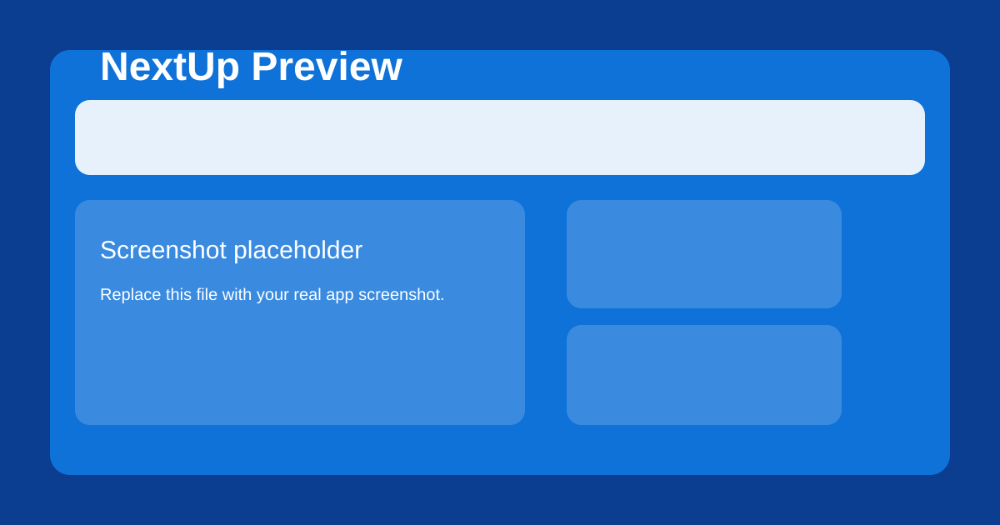

# NextUp



NextUp adalah landing page React untuk mempromosikan produk atau layanan, dibangun dengan Create React App, SCSS, Redux Toolkit, dan React Router.

## Fitur Utama

- Halaman utama responsive dengan layout modern
- Form kontak dan integrasi email
- Peta / modal interaktif
- Styling SCSS kustom terstruktur
- Build production siap untuk deploy GitHub Pages

## Cara Menjalankan Lokal

```bash
npm install
npm start
```

Lalu buka `http://localhost:3000`.

## Build Production

```bash
npm run build
```

Hasil build akan dibuat di folder `build/`.

## Deploy ke GitHub Pages

GitHub Actions sudah dikonfigurasi untuk membangun dan menerbitkan ke GitHub Pages secara otomatis saat Anda push ke branch `master`.

Setelah push ke remote, site akan tersedia di:

`https://hanjarraes.github.io/nextup`

> Jika Anda ingin mengganti screenshot dengan hasil tangkapan layar aplikasi nyata, ganti file `screenshot.svg` dengan file screenshot baru lalu update path di README.

## Struktur Project

- `src/` - kode React utama
- `public/` - aset publik dan HTML template
- `build/` - hasil production build
- `.github/workflows/` - deployment GitHub Pages otomatis

## Teknologi

- React 18
- Create React App
- Redux Toolkit
- React Router v6
- SCSS

## Remote GitHub

Remote target:

`https://github.com/hanjarraes/nextup`
